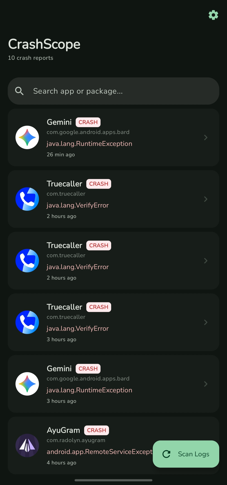
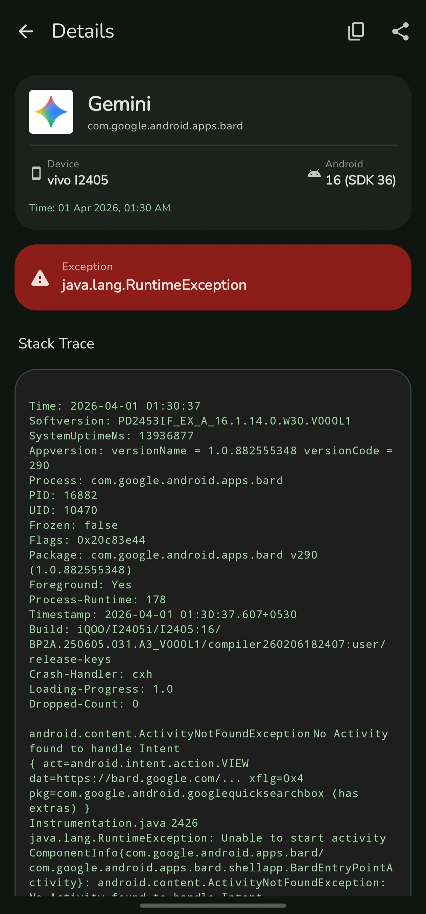
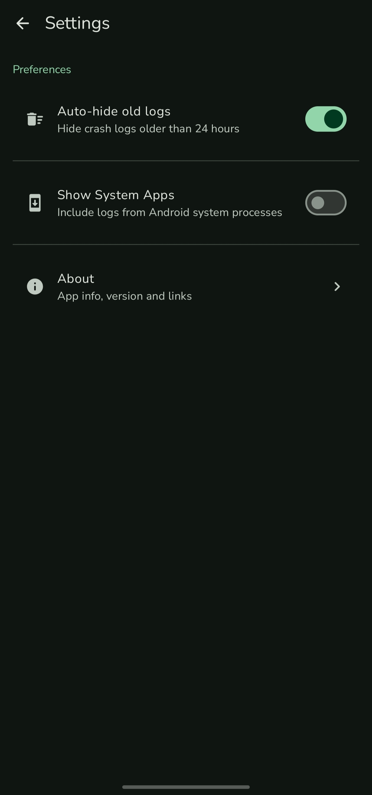

# CrashScope

CrashScope is a simple Android tool to view crash and ANR reports directly from your device. It reads reports from the system DropBox and presents them in a clean and readable way.

## Features
- View crash and ANR reports
- Read reports from Android DropBox system
- Search by app name or package
- Detailed crash view with stack trace
- Copy and share logs
- Auto-hide old logs
- Option to include system apps

## Screenshots

### Home

### Details

### Settings

## Installation
Clone the repo and build using Android Studio or AndroidIDE. Download Apk file

## Permissions
CrashScope requires access to system logs and usage data to read crash reports.

## Open Source
Licensed under the MIT License.

## Author
Cutex 
